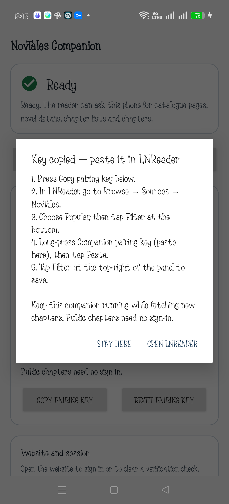

# NovTales pairing guide

## Pairing: copy once, paste once

Your Oppo is already paired. Updating either app keeps the saved key. These steps are for a new phone or a replacement key:

1. Open **NovTales Companion**, press **Start**, then **Copy pairing key**. A guide appears; tap **Open LNReader**.
2. In official LNReader, choose **Browse → Sources → NovTales**.
3. Choose **Popular**. Close the search box if it is open, then tap **Filter** at the bottom of the catalogue.
4. Long-press the **Companion pairing key (paste here)** field and tap **Paste**. If a previous key is present, select all and replace it.
5. Tap **Filter** at the top-right of the filter panel. This saves the key and loads the catalogue.

The key is private to this phone. Do not send it to anyone. Use **Reset pairing key** only when you want to replace it; then repeat the steps. Public chapters do not need NovTales sign-in.

Keep the companion running while fetching new content. Keep LNReader open for batch downloads. Saved chapters stay in LNReader and can be read offline with the companion stopped.

## Supported sources

This companion supports **NovTales only**. Other LNReader sources continue to work as usual through their own plugins; they do not use this companion. Adding another site would require a site-specific companion adapter and a compatible plugin.

